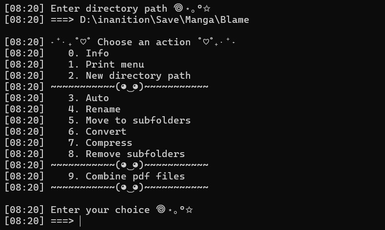

# Manga Helper

> **Note:** Manga Helper is a Python script designed to convert CBZ and CBR files to PDF and compress PDFs. I developed this script in just a few days as a small helper tool.

## Features

- **Convert CBZ and CBR to PDF**: Easily convert CBZ files into PDF format for better accessibility.
- **Compress PDF Files**: Reduce the size of PDF files while maintaining quality to save disk space.
- **Create PDFs from Images**: Combine multiple images in a folder into a single PDF file.
- **Combine Multiple PDFs**: Merge multiple PDF files from a folder into a single combined PDF.
- **Additional Utilities**: Includes functionalities for renaming files and etc

## Requirements

- Python 3.8 or higher
- Required Python libraries: `Pillow`, `PyMuPDF`, `rarfile`

## Running the Script

To run the script, follow these steps:

1. **Install the Required Libraries**

   ```bash
   pip install PyMuPDF Pillow rarfile tqdm
   ```

2. **Execute the Script**

   ```bash
   python helper.py
   ```

3. **If you want to have Exe file**

   ```bash
   pip install -U pyinstaller
   ```

   ```bash
   pyinstaller --onefile helper.py
   ```

## Example of Use



## Known Issues and Limitations

1. **Conversion Failures for Some CBZ Files**  
   Occasionally, certain CBZ files may fail to convert to PDF. This issue occurs with some rare CBZ files, and despite trying various methods to handle these cases, there isn’t a reliable solution yet.

2. **Limited PDF Compression**  
   The current compression functionality for PDF files does not significantly reduce their size. The script focuses on maintaining the original quality of the PDFs, which means that the file size might not decrease as much as expected. Future updates may include improved compression algorithms for better size reduction without compromising quality.

We appreciate your understanding regarding these limitations and are open to contributions or suggestions for improvement!

## Contributing

Contributions, issues, and feature requests are welcome! Feel free to open an issue.
